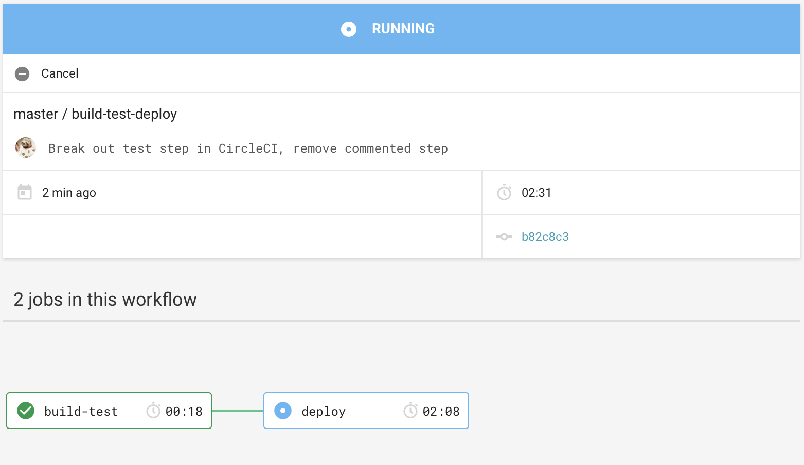

My initial goal for this project will be to build a [walking skeleton](http://wiki.c2.com/?WalkingSkeleton), or an extremely limited version of the app that allows for basic end-to-end testing. The main reason I want to start here is that I want to get something deployed as soon as possible and devops is one of the areas in which I have the least experience.

## Technology Stack
I will be using [.NET Core Web API](https://docs.microsoft.com/en-us/dotnet/core/about) for the back end. I'm familiar with C# and .NET in general, so it was the logical choice for me. I'll have plenty of other things to learn over the course of this project, so I plan to leverage existing skills where I can.

For the front end I'll use [Angular](https://cli.angular.io), because it has just about everything you need out of the box. Other popular technologies like React and Vue are essentially UI libraries rather than full-blown web application frameworks, and cobbling together my own framework requires more creativity than I'm ready to sign up for. This approach will hopefully offer the path of least resistance while still giving me some exposure to new things. Angular is also fairly mature and has a large community and excellent documentation.

## Existing Code
Since I'm rebuilding an existing application, my first instinct was to reuse the current database and let entity framework scaffold everything for me. However, after looking at the data model it would be simpler to start over and port the data that I need. The existing solution has unused tables and columns, tables without primary keys/identity columns, missing foreign keys, etc.

## Project Structure
One of my goals here will be to avoid over-engineering things. In the past, I've had a hard time making progress on side projects because I get prematurely bogged down obsessing over architecture concerns. This app should be pretty simple, so I definitely want to guard against that impulse. Now that I've rationalized my sins, here is what the Web API project looks like after adding the basic Entity Framework goodies:

{: class="w-48 sm:w-64"}

`Kid.cs` is the model for the Kid table. `SqlServerAppContext` is the Entity Framework DbContext that conntects to the SQL Server database that will hold my data. There's also a repository to retrieve data from the data context (`KidRepository`) and a controller that presents a simple API with two endpoints (`KidsController`). `/api/kids` retrieves a list of Kid records and `/api/kids/{id}` returns a single record by ID. The Kid entity is pretty simple at this point:

```csharp
public class Kid
{
    public int Id { get; set; }
    public string FirstName { get; set; }
    public string LastName { get; set; }
    public string Gender { get; set; }
    public string Grade { get; set; }
    public DateTime? Birthday { get; set; }
    public DateTime DateRegistered { get; set; }
    public bool IsActive { get; set; }
}
```

I've generated some dummy data for this table using [JSON Generator](https://next.json-generator.com), and I can see that my `/api/kids` endpoint is returning the expected records using [Postman](https://www.getpostman.com/).


At this point I have a very basic Web API solution, but it's enough for me to move on to putting together a CI/CD pipeline. I'm glossing over some things that I'll want to cover in more detail (like database seeding and paginating the `Kid` results), but I want to focus more on getting automated builds and deployment up and running.

## Build Automation
I'm using CircleCI to build and deploy the app. There are lots of good options in this realm, but CircleCI is free, has a large community, and I preferred the user experience to other candidates that I played around with.

## Production Environment
Like CI tools, there are tons of options for web hosting, but the most affordable and easiest to use that I found was [DigitalOcean](https://www.digitalocean.com). For testing, I'm using their one-click Docker app running on Linux with minimal resources.

### CircleCI Build Config
The learning curve for CircleCI wasn't awful, thanks to their blog, documentation, and forums. I ended up with a workflow consisting of two jobs called `build-test` and `deploy`. I'm sure there are plenty of improvements to be made here, but I didn't want to spend too much time this early in the project. My configuration borrows heavily from [this example](https://circleci.com/blog/build-cicd-piplines-using-docker/).

The `build-test` job uses the .NET Core SDK Docker image to build the API project and run the related unit tests. Microsoft has pretty thorough documentation around [Docker and .NET Core](https://docs.microsoft.com/en-us/dotnet/core/docker/building-net-docker-images). The main thing to note is that you'll want to use the SDK image for CI builds (as opposed to the runtime image, for example).

The `deploy` job creates a new Docker image, pushes it to Docker Hub, and then deploys it on a server I've set up on DigitalOcean (the `XXX.XXX...` is an actual IP address in the real config file). `deploy_app.sh` is a shell script that lives in the root directory on the web server (see the link above for more on that). It pulls and runs the docker image that's passed in as the single argument.

```yml
version: 2
jobs:
  build-test:
    docker:
      - image: microsoft/dotnet:2.2-sdk
    steps:
      - checkout
      - setup_remote_docker:
          docker_layer_caching: true
      - run:
          name: Build API project
          command: |
            dotnet restore ./BibleBlast.API/BibleBlast.API.csproj
            dotnet build ./BibleBlast.API/BibleBlast.API.csproj -c Release --no-restore
      - run:
          name: Run API tests
          command: dotnet test ./BibleBlast.API.UnitTests/BibleBlast.API.UnitTests.csproj

  deploy:
    machine: true
    steps:
      - checkout
      - run:
          name: Set environment variables
          command: |
            echo 'export TAG=0.1.${CIRCLE_BUILD_NUM}' >> $BASH_ENV
            echo 'export IMAGE_NAME=bible-blast' >> $BASH_ENV
      - run:
          name: Build and push Docker image
          command: |
            docker build -t jittles/$IMAGE_NAME:$TAG .
            echo $DOCKER_PWD | docker login -u $DOCKER_LOGIN --password-stdin
            docker push jittles/$IMAGE_NAME:$TAG
      - run:
          name: Deploy app to Digital Ocean Server via Docker
          command: |
            ssh -o StrictHostKeyChecking=no root@XXX.XXX.XXX.XXX "/bin/bash ./deploy_app.sh jittles/$IMAGE_NAME:$TAG"

workflows:
  version: 2
  build-test-deploy:
    jobs:
      - build-test
      - deploy:
          requires:
            - build-test
```

### CircleCI Visualization
CircleCI is set up to kick off this workflow any time it sees code get pushed to the `master` branch of the GitHub repo. The running jobs can be observed in real time:



It's also possible to drill down into an individual job and watch its steps complete. This is how the `deploy` job appears:


## Smoke Test
To make sure things have been deployed as expected, Postman just needs to be pointed to the DigitalOcean droplet instead of `localhost` (the IP address can be found in the DigitalOcean dashboard). It's possible to incorporate simple smoke testing into a CircleCI build; I might look into that farther down the road.

## Conclusion
At this point, I have a working build pipeline and my app has a couple of endpoints to verify everything is working as expected. I can see that pushing a code change causes a new build to kick off, and a new version of my app gets deployed to DigitalOcean. I glossed over a lot of details in this post, but I plan to come back to the interesting bits. I also expect a lot of it to change as I continue to work.